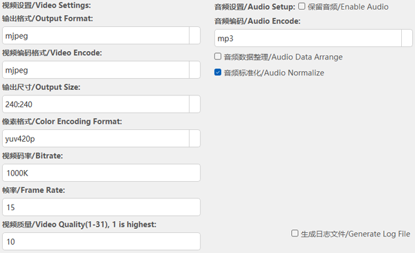
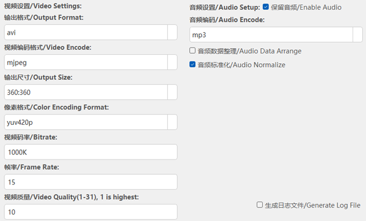
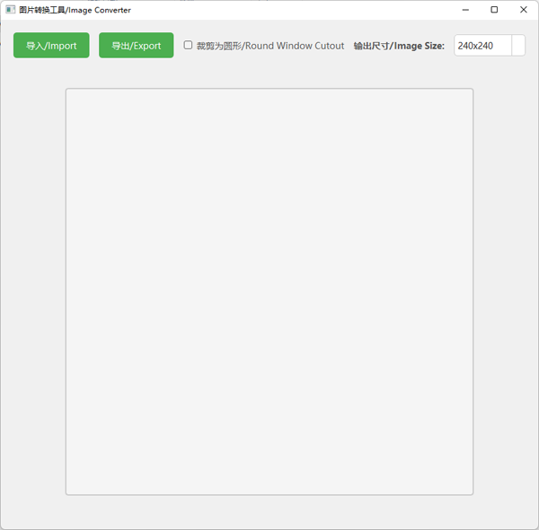

# eEGG Video & Image Converter Tools – Quick Guide

---
## Download
#### 1️⃣ Click the links below to download the converter tool software.
- ⬇️[Download Video Converter](https://github.com/ZONESTAR3D/eEGG-Tools/archive/refs/tags/VideoConverter-V0.7.zip)
- ⬇️[Download Image Converter](https://github.com/ZONESTAR3D/eEGG-Tools/archive/refs/tags/ImageConverter-V0.3.zip)

#### 2️⃣ Unzip the downloaded ZIP to any disk (e.g. D:\). **Avoid Chinese characters in the path.**

---
## Video Converter
#### 1️⃣ Launch the video converter.  

#### 2️⃣ Choose settings  
- eEGG5 ➜ use the preset shown below:  
    
- eEGG6 / eEGG7 ➜ use the preset shown below:  
  

#### 3️⃣ Add files (multi-select supported).  
#### 4️⃣ Press 「Convert」. Output files will appear in an `output` folder next to the source.  
#### When finished, upload the files to your device.

---
## Image Converter
#### 1️⃣ Launch the image converter.  

#### 2️⃣ Set display parameters  
- eEGG5 ➜ select **240×240**  
- eEGG6 / eEGG7 ➜ select **360×360**  
> Exported image file size will be smaller if 「Round Window Cutout」is selected, the visual result on device is the same.

#### 3️⃣ Click「Import」to load source images.  
#### 4️⃣ Click「Export」and enter a file name and save.  
#### When finished, upload the files to your device.
